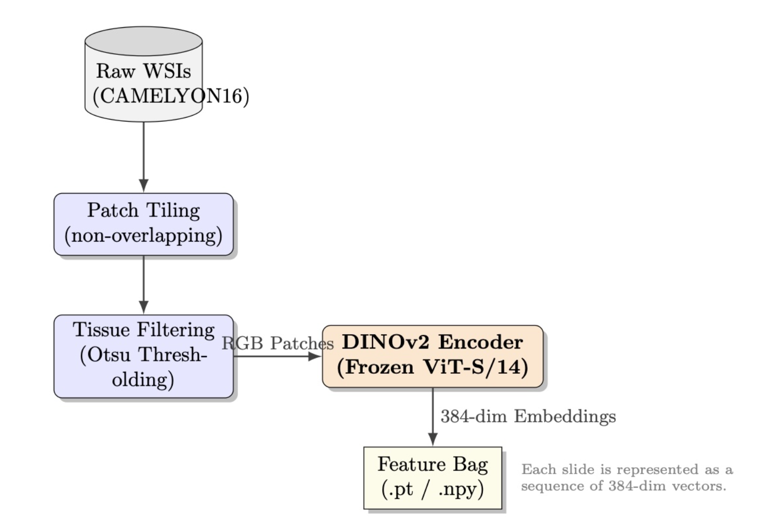
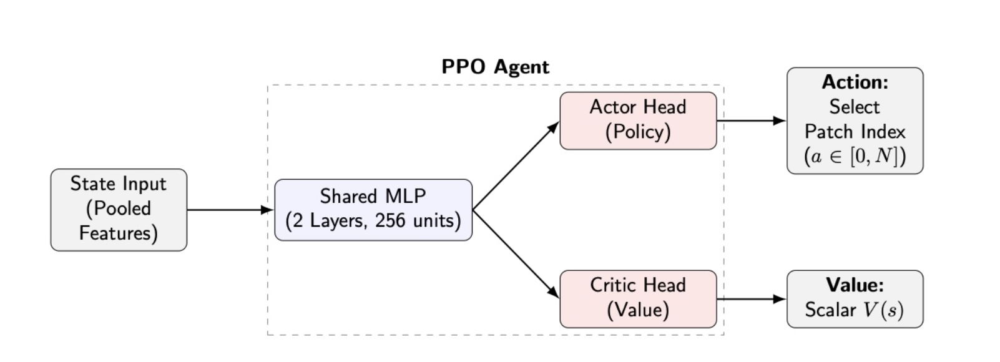

## 🧠 WSI-RL-Cancer-Navigation

PPO-based Reinforcement Learning for Whole-Slide Cancer Image Navigation (CAMELYON16)

This project explores reinforcement learning (RL) for intelligent patch navigation in high-resolution whole-slide images (WSIs). Instead of processing thousands of patches uniformly, a PPO agent learns to sequentially select informative regions under sparse supervision.

The objective is to evaluate whether learned navigation policies can:
	•	Improve patch efficiency
	•	Increase downstream classification quality
	•	Provide interpretable decision dynamics
	•	Scale toward foundation-model embeddings and biologically inspired exploration

## 🚧 Research Roadmap

### Completed
- Phase 1 — Toy RL Prototype (paper-inspired validation)
- Phase 2 — PPO Navigation on CAMELYON16
- Phase 3 — Binary Cancer Classifier on Navigation Embeddings

### In Progress
- Phase 4 — Trident-based patch tiling pipeline

### Planned Extensions
- Phase 5 — Foundation embeddings (UNI2-H / Virchow-2)
- Phase 6 — Swarm intelligence for cooperative exploration
- Phase 7 — Foveated vision for adaptive zoom navigation

## 🏥 Dataset

CAMELYON16 – Whole-slide lymph node metastasis detection benchmark.

Slides are:
	•	Tiled into non-overlapping patches
	•	Tissue-filtered via Otsu thresholding
	•	Embedded using frozen vision encoders


## 🧬 Data Pipeline

Whole-slide images are processed through tiling, tissue filtering, and frozen foundation model embedding extraction.



*Figure 1: WSI preprocessing pipeline. Slides are tiled, filtered via Otsu thresholding, and embedded using a frozen DINOv2 encoder (ViT-S/14).*

Pipeline stages:
	1.	Raw WSI input
	2.	Patch tiling (non-overlapping)
	3.	Tissue filtering (Otsu thresholding)
	4.	Feature extraction (frozen ViT-S/14 encoder)
	5.	Slide represented as a bag of 384-dim embeddings


## 🧠 Reinforcement Learning Formulation

Patch navigation is formulated as a sequential decision-making problem.

- **State:** Pooled slide embeddings (aggregated patch features)
- **Action:** Select next patch index (discrete)
- **Reward:** Sparse or shaped reward based on tumor detection signal
- **Objective:** Maximize successful tumor localization while minimizing navigation steps


## 🧩 PPO Agent Architecture

Navigation policy is trained using Proximal Policy Optimization (PPO) with an actor–critic structure.



*Figure 2: PPO agent with shared MLP backbone and actor–critic heads for discrete patch-index selection.*

Architecture details:

- Shared MLP (2 layers, 256 units)
- Actor head: categorical policy over discrete patch indices
- Critic head: scalar value function V(s)
- Discrete action space over patch indices


## 🧪 Phase 1 — Toy RL Prototype (Paper-Inspired)

Before scaling to full-resolution CAMELYON16 slides, a simplified RL prototype was implemented to validate the navigation formulation under controlled synthetic conditions.

This phase validated:

- Navigation feasibility  
- Reward shaping behavior  
- PPO convergence stability  

### Prototype Results

| Metric        | Value  |
|--------------|--------|
| Success Rate | 82.0%  |
| Mean Return  | 0.65   |
| Mean Steps   | 4.2    |

The prototype achieved rapid convergence and demonstrated that reward shaping substantially improved navigation efficiency.  
This confirmed that reinforcement learning could meaningfully optimize patch navigation before full-resolution deployment.


## 📊 Quantitative Results — CAMELYON16

### Sparse Reward (Baseline)

| Metric                  | Final Value |
|--------------------------|------------|
| Average Episode Return | -2.3       |
| Success Rate            | 0.43       |
| Training Batches        | 200        |


## 🧪 Full Evaluation on Test Slides

| Experiment            | Success Rate | Mean Return | Mean Steps |
|-----------------------|--------------|-------------|------------|
| Baseline (Sparse)     | 0.0%         | -97.7       | 997.0      |
| Prototype (Synthetic) | 82.0%        | 0.65        | 4.2        |
| Dense Reward (Final)  | **95.0%**    | **5.40**    | **120.5**  |

Dense reward shaping significantly improved convergence stability and downstream navigation efficiency.


## 🧬 Downstream Binary Cancer Classifier

After training navigation policies, selected patch embeddings were aggregated into slide-level representations.

Pipeline:
	1.	PPO agent selects informative patches
	2.	Patch embeddings aggregated
	3.	Slide-level embedding constructed
	4.	Binary classifier trained (tumor vs normal)

Preliminary findings indicate improved separability when using RL-selected patches compared to naïve or random aggregation.

This extends the project from navigation-only to an end-to-end clinical task evaluation pipeline.


## 📚 Literature Context

This work is grounded in recent advances in:
	•	Reinforcement learning for WSI navigation
	•	Multi-instance learning (MIL)
	•	Contrastive learning for pathology
	•	Adaptive patch selection under weak supervision

Primary Inspiration
	•	RL-style WSI navigation formulations (sequential patch selection)
	•	Reward shaping strategies under sparse signals

Additional Literature Surveyed
	•	MuRCL (TMI 2023): RL-driven discriminative set selection with contrastive learning
	•	Dynamic Policy-Driven Adaptive MIL (CVPR 2024): Adaptive patch selection
	•	Attention-based MIL frameworks (CLAM, ABMIL)
	•	Contrastive pathology representation learning

These works informed design decisions but were not directly implemented in the current version.


## 🔭 Research Roadmap

Planned extensions:
	•	Patch tiling with Trident
	•	Foundation embeddings using UNI2-H / Virchow-2 (HuggingFace)
	•	Swarm intelligence for cooperative patch exploration
	•	Foveated vision for adaptive zoom navigation

The objective is to move toward biologically inspired, foundation-model-enhanced navigation strategies.


## 🧠 What This Project Demonstrates
	•	Reinforcement learning in high-dimensional visual environments
	•	Reward shaping under sparse supervision
	•	Sequential patch selection in WSI analysis
	•	Strict evaluation protocol design
	•	Research-to-prototype translation
	•	End-to-end navigation + classification integration


## 🛠 Project Structure

```
wsi-rl-cancer-navigation/
│
├── configs/     # Experiment configurations (PPO variants, reward modes)
├── docs/        # Literature notes and design rationale
├── figures/     # Architecture and pipeline diagrams
├── results/     # Quantitative outputs and evaluation tables
├── src/         # Training and evaluation modules (cleaned/private)
└── README.md
```

## ⚠️ Reproducibility Note

Due to dataset licensing and ongoing research collaboration, training scripts and raw data are not publicly released. The repository documents methodology, architecture, and quantitative findings for transparency and reproducibility at the experimental design level.


## 🚀 Status

Actively evolving research prototype.

Current focus:
	•	Embedding upgrades
	•	Navigation robustness
	•	Downstream classification validation
	•	Multi-agent exploration strategies

⸻

