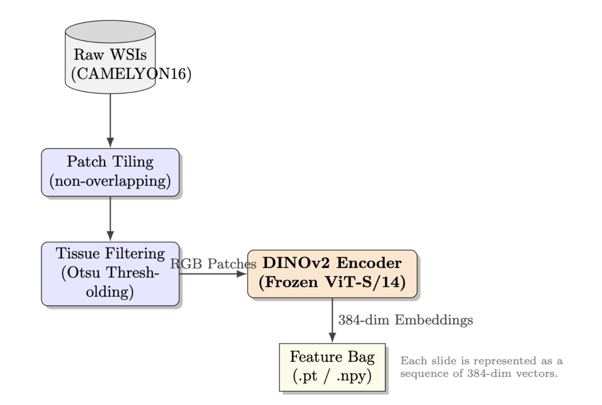
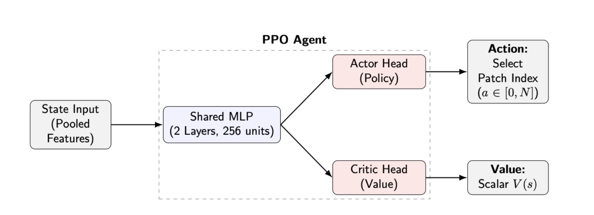

# WSI-RL Cancer Navigation

PPO-based reinforcement learning for whole-slide image (WSI) patch navigation on CAMELYON16. This research project explores whether an agent can inspect a limited number of regions, find tumor-containing tissue, and make navigation more efficient than uniform patch processing.

The repository contains a compact 384-dimensional PPO prototype and a separate UNI2-h feature extraction script. The included UNI2 extraction stage is not connected to the PPO policy: it produces raw 1,536-dimensional features, while the current PPO environment expects 384-dimensional features. The source is explicit about that boundary; the external SASHA training stages required to bridge it are not included.

## Project Goals

- Formulate patch selection as a sequential decision problem.
- Compare sparse terminal feedback with denser reward shaping.
- Measure tumor-hit success, episode return, and navigation steps.
- Explore stronger pathology representations through a separate UNI2-h feature-extraction path.
- Keep data and model artifacts external so the repository remains lightweight and respects access constraints.

## Project Status

The repository includes the PPO prototype, a small CAMELYON16 trainer/evaluator, and UNI2-h feature extraction for a 16-slide subset. It does not include CAMELYON16 slides, patch files, embeddings, trained weights, the downstream SASHA stages, or their checkpoints. The report's historical results are included below for context, but their raw logs are not available here for independent reproduction.

## WSI Data Pipeline



*Figure 1. Slide tiling, tissue filtering, and frozen feature extraction used in the project workflow.*

The WSI workflow is organized into these stages:

1. **Slide input.** Load CAMELYON16 whole-slide images. Slides are not distributed in this repository; users must obtain them under the dataset's access terms.
2. **Patch tiling.** Convert each large slide into smaller, spatially located image patches. The UNI2 extraction script consumes coordinates stored in SASHA-style HDF5 patch files rather than generating those patch files itself.
3. **Tissue filtering.** Retain tissue-containing regions and omit background where the upstream tiling pipeline provides filtered coordinates.
4. **Feature extraction.** The historical DINOv2 workflow represented regions with 384-dimensional embeddings. The added UNI2-h extractor is a distinct experiment and writes raw 1,536-dimensional features. It requires access to the gated `MahmoodLab/UNI2-h` model.
5. **Feature organization.** Store patch features together with coordinates and tumor masks for the PPO prototype, or as SASHA-format files for later external SASHA stages. These generated files are intentionally ignored by Git.

## Reinforcement Learning Formulation

The PPO prototype models navigation as an episodic Markov decision process:

- **State:** a pooled 384-dimensional slide representation, updated as regions are visited.
- **Action:** choose a discrete patch or region index.
- **Transition:** inspect the selected region and update its feature representation; the environment tracks visited regions and tumor hits.
- **Reward:** choose a reward mode. Sparse reward is delivered at the end of an episode; first-hit reward rewards detecting tumor; dense reward adds a small per-step signal and a tumor-hit bonus.
- **Termination:** an episode ends at the configured step horizon; first-hit mode can end early on a positive slide after finding tumor.
- **Evaluation:** aggregate tumor-hit success, return, steps, and time-to-hit across evaluated slides/episodes.

The implementation is in [`RLogist/environment_rlogist.py`](RLogist/environment_rlogist.py), [`RLogist/rl/env_variable_wsi.py`](RLogist/rl/env_variable_wsi.py), and [`RLogist/rl/env_variable_wsi_dense.py`](RLogist/rl/env_variable_wsi_dense.py). These are research prototypes and should not be interpreted as clinical decision systems.

## PPO Agent



*Figure 2. Actor-critic policy for discrete patch selection.*

The prototype's `PolicyNetwork` maps the pooled input through two fully connected layers, then produces policy logits over patch actions and a scalar value estimate. `PPOAgent` samples actions from a categorical distribution and updates the policy using clipped probability ratios, value loss, and an entropy term. During evaluation, the environment's action mask restricts selection to valid patches.

The report also contains historical training visualizations:

| Visualization | What it shows |
| --- | --- |
| [Sparse reward return](figures/sparse-episode_return.png) | Reported episode-return trend for sparse reward. |
| [Sparse reward success](figures/training_success-sparse.png) | Reported training success trend for sparse reward. |
| [Reward comparison](figures/average_episode-comparison.png) | Historical sparse/dense average-episode comparison. |
| [Success comparison](figures/success_rate-comparison.png) | Historical success-rate comparison. |
| [PPO losses](figures/ppo_losses-sparse.png) | Historical policy, value, and entropy loss visualization. |
| [Reward shaping summary](figures/reward_shaping_comparison.png) | Figure retained from the report workspace. |

These images are preserved as report artifacts; the underlying run logs were not supplied with the source subset, so the figures have not been regenerated against the included code.

## Reported Results

The values below are transcribed from the README that preceded this code update. They are **historical report values, not independently verified results**: the source metrics, split definitions, and checkpoints needed to reproduce them are absent from this repository. Do not compare them directly to a new run without matching the exact protocol.

### Synthetic Prototype

| Metric | Historically reported value |
| --- | ---: |
| Success rate | 82.0% |
| Mean return | 0.65 |
| Mean steps | 4.2 |

### CAMELYON16 Summary

The previous README reported the following sparse-reward training summary:

| Metric | Historically reported value |
| --- | ---: |
| Average episode return | -2.3 |
| Success rate | 0.43 |
| Training batches | 200 |

It also reported this test-slide comparison:

| Experiment | Success rate | Mean return | Mean steps |
| --- | ---: | ---: | ---: |
| Baseline (sparse) | 0.0% | -97.7 | 997.0 |
| Synthetic prototype | 82.0% | 0.65 | 4.2 |
| Dense reward (reported final) | 95.0% | 5.40 | 120.5 |

The current included `RLogist/train_camelyon.py` is a small prototype that samples from two hard-coded slide IDs. The evaluator uses a fixed list of ten slide IDs and skips slides whose embeddings are missing. Those scripts do not by themselves establish that the historical table used the same split or settings; see [experiment scope](docs/experiment-scope.md) before attempting reproduction.

## UNI2-h Feature Extraction Track

The included [`step2_extract_uni2_features.py`](sasha_adapted/preprocessing/step2_extract_uni2_features.py) loads UNI2-h through `timm`, reads patch coordinates and WSI regions, and extracts low- and high-resolution features. It is intended for the CAMELYON16 16-slide subset and expects external SASHA patch HDF5 files, slide images, a slide CSV, and Hugging Face access to the gated model.

This is an extraction step only. It is not a drop-in backbone for the PPO prototype: feature width is 1,536 for UNI2-h versus 384 for the included policy/environment. Downstream feature adaptation and SASHA training/checkpoints are outside this repository. Example commands and expected file inputs are documented in [`docs/experiment-scope.md`](docs/experiment-scope.md).

## Setup

Use Python 3.10 or newer. Install PyTorch and TorchVision using the command recommended for your operating system and accelerator at [pytorch.org](https://pytorch.org/get-started/locally/), then install the remaining dependencies:

```bash
python -m venv .venv
source .venv/bin/activate
python -m pip install --upgrade pip
python -m pip install -r requirements.txt
```

For WSI reading, install the OpenSlide system library (for example, `brew install openslide` on macOS). Practical full-slide UNI2 extraction requires a CUDA-enabled Linux environment and approved access to `MahmoodLab/UNI2-h` on Hugging Face.

## Running the PPO Prototype

Provide 384-dimensional patch embeddings, coordinates, and aligned tumor masks under `embeddings/`. See [experiment scope](docs/experiment-scope.md) for file naming and array shapes.

```bash
python -m RLogist.train_camelyon --reward first_hit
python -m RLogist.rl.evaluate_camelyon --reward first_hit --episodes-per-slide 20 --max-steps 100
```

The trainer writes model checkpoints under `RLogist/checkpoints/`. The evaluator writes per-episode logs and summary metrics under `results/`. These are runtime artifacts and are excluded from Git.

## Repository Layout

```text
RLogist/                                      PPO prototype, environments, trainer, evaluator
sasha_adapted/preprocessing/                  UNI2-h feature extraction stage
configs/                                      Notes on configuration and omitted cluster paths
docs/                                         Experiment scope and literature context
figures/                                      Report and historical training visualizations
results/                                      Runtime results location; no raw results committed
```

## Reproducibility and Data

CAMELYON16 slides, patient-level data, embeddings, HDF5 patch files, checkpoints, and generated run logs are not included. Obtain data and model access through their approved channels and follow their respective terms. Never commit private data or model credentials. The historical tables and figures above are retained to preserve report context, not as a claim that this repository can reproduce them as-is.

## Research Context

This work draws on reinforcement learning for WSI navigation, multiple-instance learning, and adaptive patch selection. The literature review also considered MuRCL, adaptive policy-driven MIL, ABMIL, and CLAM; these approaches informed project context but are not implemented in the included code. See [`docs/literature_review`](docs/literature_review).

## Intended Use

For research and education only. This code is not validated for clinical diagnosis or treatment decisions.